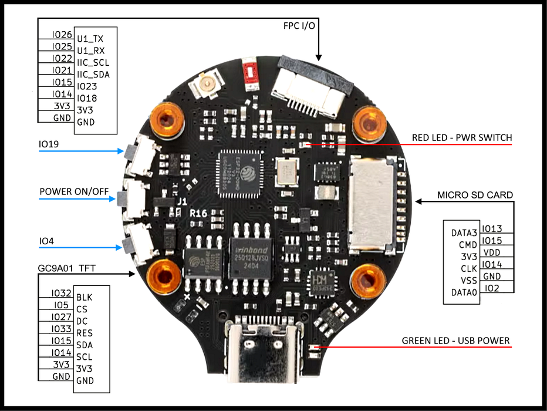

# HackerBox 107 — Round ESP32 Board

[Goto Home](/README.md)

A compact, high-quality circular ESP32 board included with **HackerBox #0107**.
Features a GC9A01 TFT header, micro-SD slot, FPC connector, and a **true hardware power switch**.

This board came with HackerBox #0107 which at the time of this writing *2025-11-30* is still available for sale on their website. [HackerBox #0107](https://hackerboxes.com/products/hackerbox-0107-dock)

Others can be found on AliExpress and other sites that are similar if not the same. Some have different features than the hackerbox example. [AliExpress Generic 1.28" Round](https://www.aliexpress.us/item/3256804725289745.html?spm=a2g0o.productlist.main.5.4f8c58c52EKvhF&algo_pvid=6e276ae7-904b-4014-948d-63cae68be47a&algo_exp_id=6e276ae7-904b-4014-948d-63cae68be47a-4&pdp_ext_f=%7B%22order%22%3A%22321%22%2C%22eval%22%3A%221%22%2C%22fromPage%22%3A%22search%22%7D&pdp_npi=6%40dis%21USD%216.45%214.13%21%21%216.45%214.13%21%40210318a717659449976692215e5d1e%2112000032757861044%21sea%21US%210%21ABX%211%210%21n_tag%3A-29910%3Bd%3A148be668%3Bm03_new_user%3A-29895&curPageLogUid=WKOaUjw7HsqM&utparam-url=scene%3Asearch%7Cquery_from%3A%7Cx_object_id%3A1005004911604497%7C_p_origin_prod%3A)



---

## Board Identification for my version

- **MCU:** ESP32 (dual-core Xtensa)
- **Board shape:** Circular PCB
- **USB:** USB-C (power + serial)
- **Display support:** GC9A01 IPS round TFT (via dedicated header)
- **Storage:** Micro-SD card slot
- **Expansion:** FPC I/O connector
- **LEDs:**
  - **Red LED** — Power switch indicator
  - **Green LED** — USB power present

---

## Pin Reference (from the included annotated diagram)

### FPC I/O
```
IO26     U1_TX
IO25     U1_RX
IO22     IIC_SCL
IO21     IIC_SDA
IO15     IO23
IO14     IO18
3V3
GND
```

### Micro-SD Card
```
DATA3    IO13
CMD      IO15
3V3      VDD
CLK      IO14
VSS      GND
DATA0    IO2
```

### GC9A01 TFT Header
```
IO32     BLK
IO5      CS
IO27     DC
IO33     RES
IO15     SDA
IO14     SCL
3V3
GND
```

### Side Buttons
- **Power ON/OFF button:** true hardware power latch
- **IO19 button**
- **IO4 button**

### FPC Connector
- Additional mixed-signal GPIO via flat-flex
- See pinout above

---

## LEDs

- **Green LED:** USB power present
- **Red LED:** Power switch enabled (board is fully powered)

---

## ESP-IDF Notes

- USB serial does **not** enumerate until the hardware power button is pressed.
- Some peripherals share GPIO lines (not unusual on compact ESP32 boards).
- GC9A01 display driver works with standard `esp_lcd_gc9a01` or Arduino GFX.

Recommended `menuconfig` items:

- Enable UART0 console
- Disable JTAG (GPIO12/13 conflict risk depending on your TFT/SD setup)
- If using SD card: set `SDMMC` or `SPI SD` pins accordingly

---

## Hardware Quirks & Warnings

### 🔌 1. True Hardware Power Switch
This is **not** a soft “EN” line. It fully disconnects the board from USB power rails.

- Plugging in USB **does NOT power the board**
- The ESP32 will **not enumerate** over USB until you press the ON/OFF button
- Pressing the switch again **cuts power completely**

### 📀 2. SD Card Pin Sharing
Some SD-card pins overlap with TFT pins (IO14 / IO15), so simultaneous SD + TFT usage requires careful configuration.

### 🔄 3. Boot / Flash Mode
If flashing fails, ensure:
- Power switch is ON
- Board is actually enumerated in Device Manager

---

## Verified Working

- [x] USB power + power button
- [x] UART0 over USB-C
- [x] GC9A01 round TFT
- [ ] SD card (not tested)
- [ ] GPIO buttons (IO19, IO4)

---


